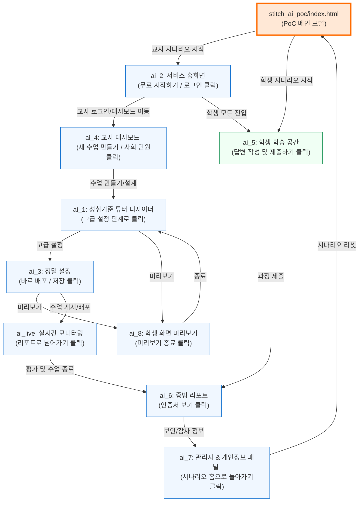

# 우리반 AI (Stitch AI) PoC 통합 프로젝트 구현 계획

이 계획은 제공해주신 화면정의서(PPTX)와 프로토타입 소스코드(ZIP)를 바탕으로, 개별적으로 분리되어 있던 9개의 하위 페이지를 유기적으로 연결하고, 이를 한눈에 탐색할 수 있는 **스마트 메인 포털(Landing Page)**을 구축하기 위한 설계도입니다.

---

## 주요 목표

1. **메인 포털 페이지 구축 (`/stitch_ai_poc/index.html`)**
   - 현대적이고 고급스러운 디자인(오렌지/차콜 테마, 글래스모피즘, 마이크로 애니메이션)의 메인 대시보드 제작.
   - 화면정의서의 **화면 Flow (교사용/학생용 시나리오 흐름)**를 시각화하여 사용자가 한눈에 진행 상황을 보고 각 단계로 즉시 이동할 수 있게 구현.
   - 각 개별 페이지(`ai_1` ~ `ai_8`, `ai_live`)에 대한 설명 및 썸네일(제공된 `screen.png` 활용) 카드 제공.
2. **시나리오 간 유기적 연결 (End-to-End Walkthrough)**
   - 교사 여정(수업 설계 -> 대시보드 -> 실시간 지도 -> 리포트 확인 -> 데이터 관리)과 학생 여정(학습 참여 -> AI 튜터 대화 -> 리포트 생성)을 매끄러운 흐름으로 자동 연결.
   - 각 하위 페이지의 버튼 및 액션을 실제 상대 경로 링크로 업데이트하여 모형(PoC)이 완벽하게 시뮬레이션되도록 구현.
3. **통합 네비게이터(PoC Controller) 추가**
   - 모든 하위 페이지에 화면 구석에 플로팅되는 최소화 가능한 **'PoC 시나리오 가이드 패널'**을 주입하여, 시연 중 언제든지 메인으로 돌아가거나 다른 단계로 빠르게 건너뛸 수 있도록 지원 (시연 편의성 극대화).

---

## 1. 인터랙티브 시나리오 흐름 설계

화면정의서에 기술된 시나리오에 따라 다음과 같이 흐름을 설계합니다.

---

## 2. 하위 페이지별 연결 세부 사항

각 페이지의 `code.html` 파일 내부의 주요 버튼 링크를 아래와 같이 수정합니다.

### A. 교사용 여정 (Teacher Journey)

1. **`ai_2` (홈화면/랜딩)**
   - `무료 시작하기`, `교사 대시보드로 이동` 버튼 -> `../ai_4/code.html`로 링크
   - 하단 고정 바:
     - `교사 대시보드` -> `../ai_4/code.html`
     - `학생 화면 보기` -> `../ai_5/code.html`
     - `리포트 보기` -> `../ai_6/code.html`
2. **`ai_4` (교사 대시보드)**
   - `새 수업 만들기`, `열기 →` (사회 단원 혹은 임의의 활성 카드) -> `../ai_1/code.html`로 링크
   - 상단 내비의 '수업 도구' 또는 대시보드 '진행중' 탭 내 카드 -> `../ai_live/code.html`로 링크
3. **`ai_1` (성취기준 튜터 디자이너)**
   - `고급 설정 단계로` 버튼 -> `../ai_3/code.html`로 링크
   - `학생 화면 미리보기` 버튼 -> `../ai_8/code.html`로 링크
   - `임시저장` 또는 취소 아이콘 -> `../ai_4/code.html`로 링크
4. **`ai_3` (정밀 설정)**
   - `학생 화면 미리보기` 버튼 -> `../ai_8/code.html`로 링크
   - `바로 배포` 및 `고급 설정 저장` 버튼 -> `../ai_live/code.html` (수업 시작 및 실시간 모니터링)로 링크
   - `초기 설정으로 복구` 또는 취소 아이콘 -> `../ai_1/code.html`로 링크
5. **`ai_8` (학생 미리보기 팝업)**
   - `미리보기 종료` 버튼 -> `../ai_1/code.html`로 링크
6. **`ai_live` (실시간 지도/모니터링)**
   - `리포트로 넘어가기` 버튼 -> `../ai_6/code.html`로 링크
7. **`ai_6` (평가 설명 리포트)**
   - `학습 과정 인증서 (지적 영수증) 보기` 또는 관련 인증서 버튼 -> `../ai_7/code.html`로 링크
8. **`ai_7` (보안 및 동의 패널)**
   - `시나리오 홈으로 돌아가기` 버튼 -> `../index.html` (PoC 메인 포털)로 링크

### B. 학생용 여정 (Student Journey)

1. **`ai_5` (학생 학습 공간)**
   - `제출하기` 버튼 클릭 시: 
     - "학습 과정 및 사고 데이터가 실시간으로 교사에게 전달되었습니다. 과정 평가 리포트가 생성되었습니다!" 문구와 함께 **[리포트 보러가기]** 버튼이 포함된 세련된 글래스모피즘 모달창을 띄우고, 클릭 시 `../ai_6/code.html`로 이동하도록 개선.

---

## 3. 포털 메인 페이지 디자인 (`/stitch_ai_poc/index.html`) [NEW]

- **비주얼 스타일:**
  - 헤더: 투명 배경의 글래스모피즘 바, 로고("우리반 AI PoC") 및 포트폴리오 메인 홈 링크 포함.
  - 히어로 섹션: "교육과 기술의 조화, 우리반 AI PoC 시나리오 센터". 역동적인 그라데이션 텍스트, 3분 시연 안내 문구.
  - **시나리오 로드맵 (화면 Flow):**
    - 교사용 및 학생용 흐름을 잇는 시각적인 노드 기반의 **인터랙티브 단계 뷰어**를 제작.
    - 각 노드를 클릭하면 해당 페이지에 대한 간략한 시나리오 설명(예: "성취기준을 선택하고 질문지를 설계하는 단계")과 함께 썸네일 미리보기, 그리고 "해당 단계 바로 시연하기" 링크가 제공됨.
  - **전체 화면 리스트 (Grid Layout):**
    - `ai_1`부터 `ai_live`까지 9개의 화면을 카드 형태로 배치.
    - 각 카드에는 **제공된 `screen.png`를 썸네일**로 표시하고, 제목, PPTX 정의서 상의 목적, 바로가기 버튼 배치.
  - **시뮬레이션 모드 지원:**
    - "교사 시뮬레이션 시작", "학생 시뮬레이션 시작" 버튼을 크게 배치하여 첫 화면부터 매끄럽게 흐름을 타고 갈 수 있게 가이드 제공.

---

## 4. 공통 PoC 헬퍼 내비게이터 주입

시연자가 임의로 페이지를 건너뛰거나 현재 시나리오 위치를 인지할 수 있도록, 모든 `code.html` 파일에 자동으로 로드되는 **경량 플로팅 내비게이터(Floating PoC Controller)**를 추가합니다.

- **기능:**
  - 화면 우측 하단에 조그마한 `psychology` 아이콘 형태의 플로팅 버튼 배치.
  - 클릭 시 슬라이드 아웃되어 현재 시나리오 맵(1단계 ~ 10단계)을 보여주고, 완료된 단계 표시 및 원하는 단계로 즉각 이동하는 메뉴 제공.
  - "메인 포털로 돌아가기" 버튼 포함.
  - 기존 UI의 디자인에 전혀 방해되지 않도록 깔끔하게 설계(Backdrop blur + Minimalist design).

---

## 5. 검증 계획

- **로컬 검증:**
  - `python -m http.server 8000` 또는 `npm run dev` 등을 통해 로컬 웹 서버를 실행하고, 브라우저를 통해 메인 포털 및 하위 페이지들의 클릭 링크가 깨짐 없이 원활하게 연동되는지 체크.
  - 모바일 반응형 뷰포트에서도 레이아웃이 깨지지 않고 완벽히 작동하는지 확인.
- **시나리오 검수:**
  - 교사 흐름(Landing -> Dashboard -> Tutor Design -> Advanced -> Preview -> Monitoring -> Report -> Consent)이 막힘없이 끝까지 유기적으로 동작하는지 수차례 수동 시뮬레이션 수행.
  - 학생 흐름(Landing -> Learning -> Report)의 연동 완성도 체크.

---

계획에 대해 검토해 주시고 승인해 주시면 바로 작업을 시작하겠습니다. 궁금한 점이 있으시거나 변경을 원하시는 부분이 있다면 말씀해 주세요!
